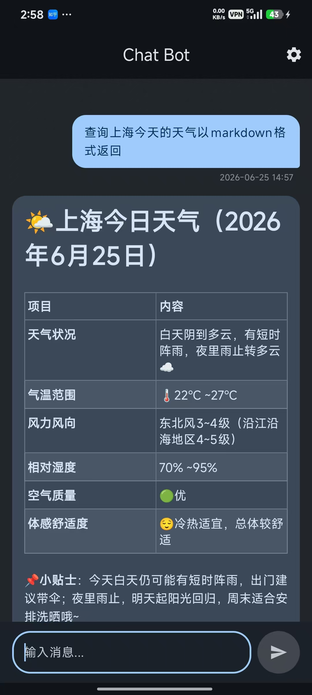
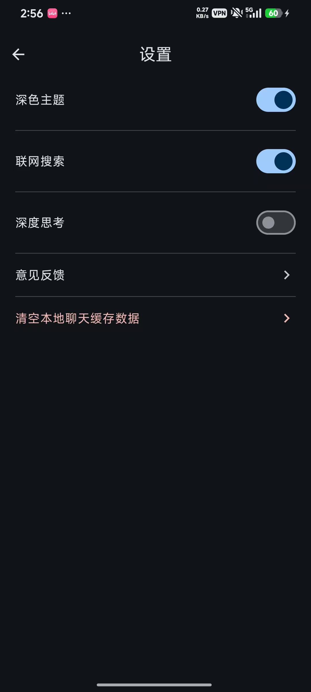

# ChatBot - Android AI Assistant

<div align="center">


</div>

## 🌐 Languages / 语言选择

| [English](README.en-US.md) | [简体中文](README.zh-CN.md) |
| :---: | :---: |
| 🇺🇸 English version | 🇨🇳 中文版本 |

---

## 📖 About / 关于

**English**: A modern Android AI chatbot application built with Jetpack Compose, integrated with DeepSeek API and supporting Markdown rendering.

**中文**: 一个基于 Jetpack Compose 构建的现代 Android AI 聊天机器人应用，接入了 DeepSeek API 并支持 Markdown 渲染。

## ✨ Features / 特性

### English
- **Smart Conversations**: Integrated with DeepSeek large language model for intelligent responses.
- **Markdown Support**: Supports code blocks, lists, bold text, links, and other Markdown formats.
- **Modern UI**: Built entirely with Jetpack Compose and Material 3 design.
- **Dark Mode**: Supports system dark mode switching.
- **Web Search**: Toggle web search feature in settings.
- **User Feedback**: Built-in feedback system connected to Supabase backend.

### 中文
- **智能对话**：接入 DeepSeek 大语言模型，提供智能响应。
- **Markdown 支持**：支持代码块、列表、加粗、链接等 Markdown 格式渲染。
- **现代化 UI**：完全使用 Jetpack Compose 和 Material 3 设计。
- **深色模式**：支持系统深色模式切换，保护视力。
- **联网搜索**：可在设置中开启/关闭联网搜索功能。
- **用户反馈**：内置反馈系统，连接 Supabase 后端。

##  Quick Start / 快速开始

### Clone / 克隆
```bash
git clone https://github.com/lilongmin1109/ChatBot.git
cd ChatBot
```

### Configure API Keys / 配置 API Key
Create or edit `local.properties` in the project root:

在项目根目录创建或编辑 `local.properties`：

```properties
DEEPSEEK_API_KEY=your_DEEPSEEK_API_key
SUPABASE_URL=your_SUPABASE_project_URL
SUPABASE_KEY=your_SUPABASE_anonymous_key
```

### Build and Run / 构建运行
Open the project in Android Studio, sync Gradle, and run on your device or emulator.

在 Android Studio 中打开项目，同步 Gradle 并运行到设备或模拟器。

## 🛠️ Tech Stack / 技术栈

- **Language / 语言**: Kotlin
- **UI Framework / UI 框架**: Jetpack Compose (Material 3)
- **Networking / 网络请求**: Ktor Client
- **Async Processing / 异步处理**: Kotlin Coroutines & Flow
- **Markdown Rendering / Markdown 渲染**: `compose-markdown`
- **Backend Service / 后端服务**: Supabase
- **Architecture / 架构模式**: MVVM (ViewModel, Repository, Data Sources)

## 📸 Screenshots / 应用截图

<div align="center">

| Chat Screen / 聊天界面 | Settings Screen / 设置页面 |
| :---: | :---: |
|  |  |

</div>

## 📄 License / 开源协议

This project is licensed under the [MIT License](LICENSE).

本项目采用 [MIT License](LICENSE) 开源。

## 🔗 Links / 链接

- [English Documentation](README.en-US.md) - Full English documentation
- [中文文档](README.zh-CN.md) - 完整中文文档

## 🤝 Contributing / 贡献

Contributions are welcome! Please feel free to submit a Pull Request.

欢迎贡献！请随时提交 Pull Request。

---

<div align="center">

Made with ❤️ using Kotlin & Jetpack Compose

</div>
